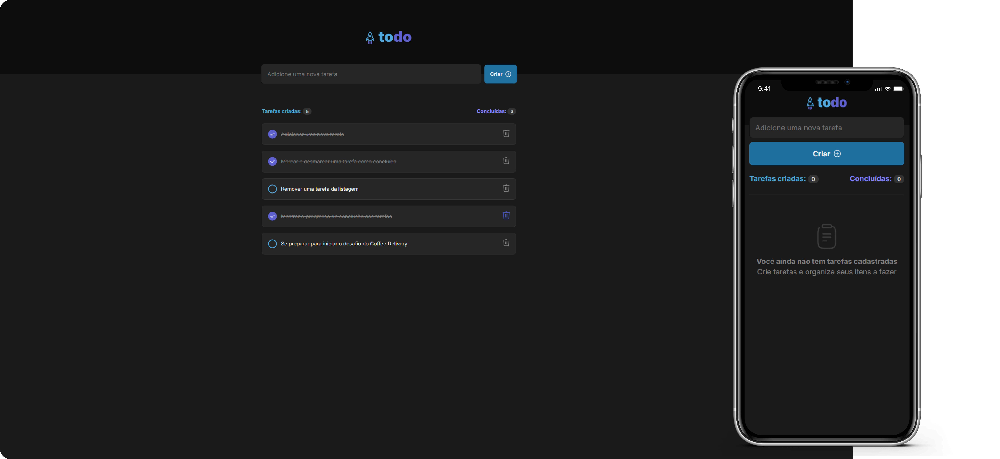

# Todo

## 📸 Preview da Aplicação

<div align="center">
    
</div>

## Projeto

> Formação React - Rocketseat

Este é um projeto desenvolvido como parte da trilha de ReactJS do Ignite, com o objetivo de reforçar os principais conceitos do React e aprimorar a capacidade de construir aplicações interativas e responsivas.

A aplicação consiste em uma lista de tarefas (To-Do List), permitindo que o usuário adicione, remova e marque tarefas como concluídas, além de visualizar o progresso de suas atividades.

## ✨ Funcionalidades da Aplicação

- **Adicionar uma nova tarefa:** Permite cadastrar uma nova tarefa na lista.
- **Marcar e desmarcar uma tarefa como concluída:** Possibilita alternar entre tarefa pendente e concluída.
- **Remover uma tarefa:** O usuário pode excluir uma tarefa indesejada.
- **Exibir progresso de conclusão das tarefas:** Mostra o percentual de tarefas concluídas.
- **Responsividade:** Adaptei o layout para mobile.

### 🚀 Conceitos abordados

**Estados no React**
**Imutabilidade do estado**
**Listas e chaves no ReactJS**
**Componentização**

## 🛠️ Tecnologias Utilizadas

- ReactJS
- JavaScript
- CSS Modules
- Vite (para build e desenvolvimento rápido)

## 📦 Como executar o projeto

Para rodar o projeto localmente, siga os passos abaixo:

```bash
# Clone este repositório
$ git clone https://github.com/BrushColor/desafio-to-do-ReactJS

# Acesse a pasta do projeto
$ cd nome-do-repositorio

# Instale as dependências
$ npm install

# Inicie a aplicação
$ npm run dev
```

<p align="center"><em>A aplicação estará disponível no navegador no endereço http://localhost:5173/.</em></p>

